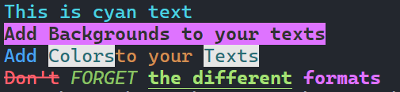

# go-color



A simple Go package for adding colors and formatting to terminal output.

## Features

- Easy-to-use API for styling terminal text.
- Supports text and background colors.
- Allows bold and combined styles.

## Installation

```bash
go get github.com/idarkssj/go-color
```

## Usage

```go
package main

import (
    "fmt"
    "github.com/idarkssj/go-color"
)

func main() {
    // Create an Instance of Color
    title := co.BgBBlack.Join(co.White).Bold()
    fmt.Println(title.Paint("Title"))

    // Format as Function
    fmt.Println(co.Bold().Paint("Bold Text"))

    // Format as Method
    fmt.Println(co.Red.Bold().Paint("Make this text bold and red"))

    // Use the Join method to combine Background and Text Colors
    fmt.Println(co.Green.Join(co.BgWhite).Paint("Green text with white background"))
    fmt.Println(co.BgGreen.Join(co.White).Paint("Green text with white background"))

    fmt.Println(co.Blue.Paint("This is blue text"))
    fmt.Println(co.Blue.Bold().Paint("This is bold blue text"))
    fmt.Println(co.Green.Join(co.BgWhite).Paint("Green text with white background"))

    // Nested Formats
    fmt.Println(co.Underline().Italic().Paint("This is underlined and italic text"))
}
```

### Output Example


## Available Colors

### Text Colors

| Standard     | Bright        |
| ------------ | ------------- |
| `co.Black`   | `co.BBlack`   |
| `co.Red`     | `co.BRed`     |
| `co.Green`   | `co.BGreen`   |
| `co.Yellow`  | `co.BYellow`  |
| `co.Blue`    | `co.BBlue`    |
| `co.Magenta` | `co.BMagenta` |
| `co.Cyan`    | `co.BCyan`    |
| `co.White`   | `co.BWhite`   |

### Background Colors

| Standard       | Bright          |
| -------------- | --------------- |
| `co.BgBlack`   | `co.BgBBlack`   |
| `co.BgRed`     | `co.BgBRed`     |
| `co.BgGreen`   | `co.BgBGreen`   |
| `co.BgYellow`  | `co.BgBYellow`  |
| `co.BgBlue`    | `co.BgBBlue`    |
| `co.BgMagenta` | `co.BgBMagenta` |
| `co.BgCyan`    | `co.BgBCyan`    |
| `co.BgWhite`   | `co.BgBWhite`   |

### Formats

| Function         |
| ---------------- |
| `co.Bold()`      |
| `co.Dim()`       |
| `co.Italic()`    |
| `co.Underline()` |
| `co.St()`        |

## Contributing

Feel free to submit issues or pull requests on [GitHub](https://github.com/idarkssj/go-color).

## License

This is free and unencumbered software released into the public domain.  
For more details, see the [LICENSE](LICENSE) file or visit [unlicense.org](https://unlicense.org).
